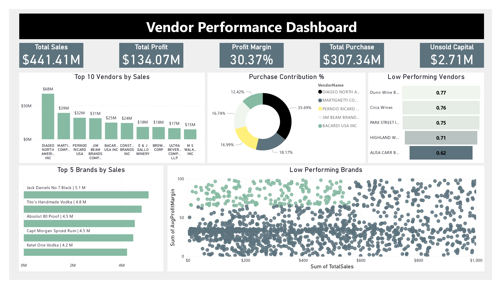

# Vendor Performance Analysis - Retail Inventory & Sales

*Analyzing vendor efficiency and profitability to support strategic purchasing and inventory decisions using SQL, Python, and Power BI.*

---

## Table of Contents
- [Overview](#overview)
- [Business Problem](#business-problem)
- [Dataset](#dataset)
- [Tools & Technologies](#tools--technologies)
- [Project Structure](#project-structure)
- [Data Cleaning & Preparation](#data-cleaning--preparation)
- [Exploratory Data Analysis (EDA)](#exploratory-data-analysis-eda)
- [Research Questions & Key Findings](#research-questions--key-findings)
- [Dashboard](#dashboard)
- [How to Run This Project](#how-to-run-this-project)
- [Final Recommendations](#final-recommendations)
- [Author & Contact](#author--contact)

---

## Overview
This project evaluates vendor performance and retail inventory dynamics to drive strategic insights for purchasing, pricing, and inventory optimization. A complete data pipeline was built using SQL for ETL, Python for analysis and hypothesis testing, and Power BI for visualization.

---

## Business Problem
Effective inventory and sales management are critical in the retail sector. This project aims to:
- Identify underperforming brands needing pricing or promotional adjustments.
- Determine vendor contributions to sales and profits.
- Analyze the cost-benefit of bulk purchasing.
- Investigate inventory turnover inefficiencies ($2.71M in unsold stock identified).
- Statistically validate differences in vendor profitability using Hypothesis Testing.

---

## Dataset
- **Raw Data:** Multiple CSV files located in the `/data/` folder (Sales, Vendors, and Inventory).
- **Processed Data:** A summary table created from ingested data used for final statistical analysis.

---

## Tools & Technologies
- **SQL:** Common Table Expressions (CTEs), Joins, and Window Functions for data transformation.
- **Python:** `Pandas` for data manipulation, `Matplotlib/Seaborn` for EDA, and `Scipy` for Hypothesis Testing.
- **Power BI:** Interactive Dashboards and DAX for business KPIs.
- **GitHub:** Version control and project documentation.

---

## Project Structure
```text
vendor-performance-analysis/
├── README.md
├── requirements.txt
├── vendor_performance_report.pdf
├── notebooks/
│   ├── exploratory_data_analysis.ipynb
│   └── vendor_performance_analysis.ipynb
├── scripts/
│   ├── ingestion_db.py
│   └── get_vendor_summary.py
└── dashboard/
    └── vendor_performance_dashboard.pbix
```
## Data Cleaning & Preparation
To ensure data integrity, the following steps were taken:

- Filtering: Removed transactions with Gross Profit <= 0, Profit Margin <= 0, or Sales Quantity = 0.

- Aggregation: Created summary tables with vendor-level metrics.

- Standardization: Converted data types, handled outliers in freight costs, and merged lookup tables for a unified view.

---
## Exploratory Data Analysis (EDA)
- Key Insights Identified:
Negative Values: Detected significant loss-making sales with a minimum Gross Profit of -52,002.78.

- Outliers: High Freight Costs (up to 257k) and skewed Purchase Prices were identified and capped.

- Correlations: - Strong correlation (0.999) between Purchase Qty and Sales Qty.

- Negative correlation (-0.179) between Profit Margin and Sales Price, suggesting price-sensitive demand.

## Research Questions & Key Findings
- Promotion Targets: Identified 198 brands with low sales volume but high profit margins.

- Vendor Risk: The Top 10 vendors account for 65.69% of purchases, indicating a significant risk of over-reliance.

- Bulk Savings: Analyzed a 72% cost saving per unit when utilizing large-scale orders.

- Inventory Bottlenecks: Found $2.71M worth of unsold inventory currently tying up capital.

- Statistical Validation: A T-Test was performed on vendor groups. The p-value was < 0.05, allowing us to reject the Null Hypothesis and confirm that top and low-performing vendors operate under distinct profitability models.

## Dashboard
- The Power BI Dashboard provides a 360-degree view of the supply chain:

- Vendor Sales Summary: Highlighting top contributors to Gross Profit.

- Inventory Health: Tracking turnover rates and unsold stock value.

- Savings Tracker: Visualizing the impact of bulk purchasing on unit costs.


---

## How to Run This Project
- Prerequisites
Python 3.8+

- SQL Environment (SQLite or similar)

- Power BI Desktop

Steps
1. Clone the repository:

```Bash
git clone https://github.com/rohannagotkaranalyst/vendor_performance_analysis_sql_python_powerbi.git
```
2. Install dependencies:
```Bash
pip install -r requirements.txt
```
3. Run Data Ingestion:
```Bash
python scripts/ingestion_db.py
```
4. Run Analysis: Execute the notebooks in /notebooks/ to see the statistical results.

---

## Final Recommendations
- Diversify Vendor Base: Actively recruit new suppliers to mitigate the 65% dependency risk.

- Optimize Inventory: Clear the $2.71M in unsold stock through clearance sales or storage strategy revisions.

- Price Sensitivity: Adjust pricing for the 198 identified high-margin brands to stimulate sales volume.

- Leverage Bulk Orders: Continue prioritizing bulk purchasing where unit cost savings exceed 70%.

---
## Author & Contact

**Rohan Nagotkar**  
Data Analyst  
Email: rohannagotkar009@gmail.com  
[LinkedIn](https://www.linkedin.com/in/rohan-nagotkar)